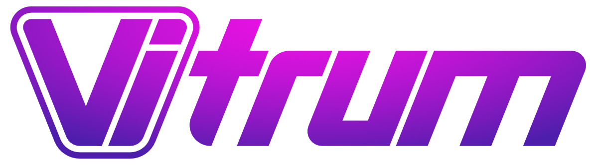
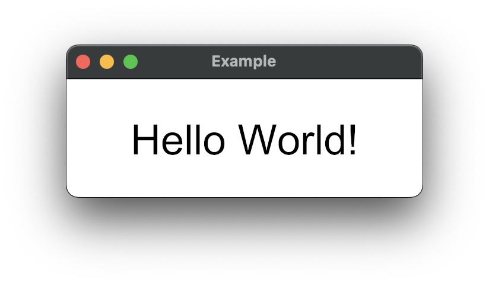

<p align="center">
    
</p>

gui [](https://pkg.go.dev/github.com/omniskop/vitrum/gui)
vit [](https://pkg.go.dev/github.com/omniskop/vitrum/vit)


Vitrum is a Cross-Platform GUI framework for Go.  
The key feature is a purpose built language called "Vit" which is based on [QML](https://doc.qt.io/qt-6/qmlapplications.html) with some modifications. The goal of this is to enable the developer to quickly and easily describe the desired UI without having to use Go which isn't really well suited for this in my opinion. Go can instead be used to implement the functionality of the application where it is much more useful.

- [The Current State](#the-current-state)
- [Getting Started](#getting-started)
- [Package Structure](#package-structure)
- [Background](#background)

# The Current State

To cut it short: In the current state you should not use this in any kind of productive application. It might never reach an acceptable state and it is basically guaranteed that things will break along the way. If you are still interested, want to give it a try or even contribute, welcome to Vitrum.

The development of Vitrum started as part of my (omniskop) Masters thesis and has reached a state where it can be used to implement rudimentary ui's that don't have to look pretty. Vit (the language) has been implemented to a large portion. Vitrum is currently primarily limited by the following aspects:
- lack of components
  - Only a very basic set of components is bundled with Vitrum but it isn't too complicated to add new ones.
- limited graphical features (no gradients and shadows)
  - This is primarily due to the use of the [Canvas](github.com/tdewolff/canvas) library as a middleware for graphics. For actually rendering the windows we are using [Gio](https://gioui.org) which ironically is another Go gui library. (Check it out if you haven't!)
- Bad Usability
  - Text inputs are currently implemented very crudely, there is no cursor, text can't be selected and there is no support for copy paste. These are just some the most obvious issues.

# Getting Started

Getting started with a new Vitrum project is pretty straight forward.
The following code will result in a window with the text "Hello World!" in the middle:

**main.go**
```go
package main

import (
	"log"
	"os"

	"github.com/omniskop/vitrum/gui"
	"github.com/omniskop/vitrum/vit/vpath"
)

func main() {
	app := gui.NewApplication()
	app.SetLogger(log.New(os.Stdout, "app: ", 0))
	_, err := app.NewWindow(vpath.Local("main.vit"))
	if err != nil {
		log.Fatal(err)
	}
	err = app.Run()
	if err != nil {
		log.Fatal(err)
	}
}
```

**main.vit**
```qml
import Vit 1.0
import GUI 1.0

Window {
    title: "Example"
    width: 300
    height: 100

    Text {
        text: "Hello World!"
        horizontalAlignment: Text.AlignHCenter
        verticalAlignment: Text.AlignVCenter
        anchors.centerIn: parent
        font.pointSize: 100
    }
}
```

The result:
<p align="center">
    
</p>

A quick note on libraries: To allow a library to be imported in Vit its Go equivalent has to be imported as well. Otherwise the parser doesn't know of its existence at runtime. In this example the package "github.com/omniskop/vitrum/gui" defines Vit library "GUI" which is then imported in 'main.vit'. 'gui' itself imports the standard library ("Vit") which allows it to imported as well. If this wasn't the case it would be necessary to import its Go package as well like this: `import _ "github.com/omniskop/vitrum/vit/std"` 

There is a more complex example project that implements a simple [calculator](https://github.com/omniskop/vitrum-calculator-de) using vit. It contains comments in German as it was created for my thesis but the code should be mostly self explanatory.

# Package Structure

The following are the most important packages of Vitrum:

- ["vit"](https://pkg.go.dev/github.com/omniskop/vitrum/vit) - The central package for the Vit language. It handles all runtime aspects and provides the necessary functions to interact with a Vit application.
- ["vit/parse"](https://pkg.go.dev/github.com/omniskop/vitrum/vit/parse) - Contains the lexer and parser for Vit, as well as Code concerning the instantiation of Documents and Components.
- ["vit/std"](https://pkg.go.dev/github.com/omniskop/vitrum/vit/std) - The standard library of Vit. It contains all the basic components for text, images, layout, etc. It can be imported using `import Vit 1.0` in Vit files.
- ["vit/vpath"](https://pkg.go.dev/github.com/omniskop/vitrum/vit/vpath) - This package provides a common way to address different files that might be located in different sources. It supports arbitrary file systems that implement the [ReadDirFS](https://pkg.go.dev/io/fs#ReadDirFS) interface. This allows it to load files from the local file system as well as files that are embedded in the executable itself. This is the primary mechanism to bundle assets with Vitrum applications.
- ["vit/generator"](https://pkg.go.dev/github.com/omniskop/vitrum/vit/generator) - A standalone tool which generated Go Code from Vit files. This is used to quickly create a baseline for new components. Which can then be extended manually. This is the default way to create new components in libraries as they contain a lot of boilerplate code. This pattern can for example be observed in the standard library where most components consist of three files: a Vit file which contains all properties of the component, a generated Go file ending with "_gen.go" which is automatically created base on the first file and a Go file that contains the actual implementation of the components logic. The Vit file itself is not used at runtime. It is recommended to not modify the generated file as it would be overwritten when the Vit file is changed.
- ["controls"](https://pkg.go.dev/github.com/omniskop/vitrum/controls) - This Vit library contains a set of components that allow a user to interact with the application like buttons and text inputs.
- ["gui"](https://pkg.go.dev/github.com/omniskop/vitrum/gui) - This package it the primary interaction point with Vitrum. It provides the Application and Window structs which are used to create an actually visual application. It also contains a Vit library which enables the Vit code to interact with the Window in which it is running. The fact that this part of Vitrum is separated in this way makes it possible to potentially use Vit with other rendering backends. For example a PDF renderer would be possible in this way as Vit itself doesn't necessarily has to to run in interactive Applications.

# Background

I think Go has huge potential in the GUI space. It is relatively easy to learn but provides better performance and more safety than for example JavaScript. 
The actual description of the UI though could be a bit tedious in Go. A dedicated purpose built language is much better suited for this task. I had already used QML as a part of Qt in conjunction with Go in a previous project ([Firefly](https://github.com/omniskop/firefly)) and I think the language has a lot of potential. It is easy to use and combines structure, styling and event basic functionality into a single package.
For Vitrum this language is called "Vit" and has some modifications compared to QML. It is mostly compete but it is possible that the syntax will change in the future to make it more fitting for this specific project and move it away from it's Qt origin.
The ability to use a dedicated language for the UI was the main reason against using existing GUI Libraries for Go. But in principle Vit could be integrated into other libraries. In fact Vitrum is currently using [Gio](https://gioui.org) in the backend for rendering all graphics and interacting with the OS.

The goal of Vitrum would be to provide an alternative to electron with newer languages and without the need for a massive tech stack and a whole browser. This is of course extremely unrealistic, especially for a single person, but I think it is a start in the right direction. Who knows what might come of it if enough people believe in this idea and contribute.


